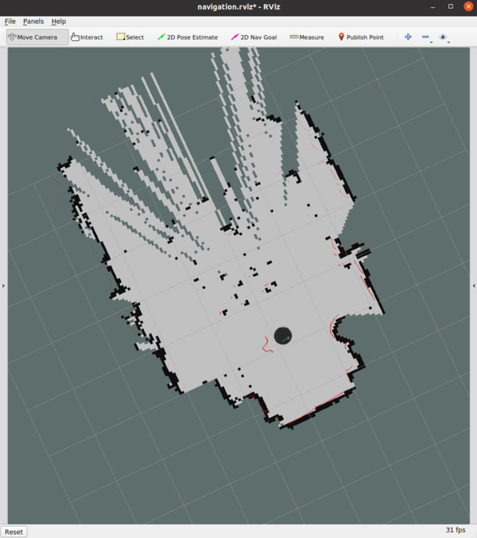
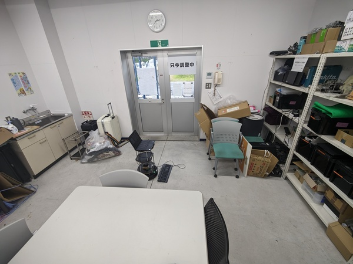

# Turtlebot2でナビゲーションする

とりあえずナビゲーションを動かすことを目標にしているので詳しいことは解説しません。
興味が湧いたら先輩に聞いてみたり、自分で調べてみてください。

以下の環境でテスト済み

- Ubuntu 20.04
- ROS Noetic
- Turtlebot2
- RPLiDAR A1

## 準備

ROSがまだセットアップされていない人は[このスクリプト](https://github.com/ryuichiueda/ros_setup_scripts_Ubuntu20.04_desktop)を、
Turtlebot2がまだセットアップされていない人は[このスクリプト](https://github.com/shutosheep/turtlebot2_on_noetic)を使うこと!

### rplidar_ros

RPLiDARをROSで使うためのパッケージ

```bash
cd ~/catkin_ws/src
git clone -b dev-ros1 https://github.com/Slamtec/rplidar_ros.git
```

### emcl

自己位置推定のパッケージ。

```bash
git clone https://github.com/ryuichiueda/emcl.git
```

### laser_filters

LiDARの取得したデータをフィルタリングするパッケージ。
センサがロボットの支柱も読み取ってマッピングや自己位置推定によくないのでそれの対策。

```bash
sudo apt install ros-noetic-laser-filters
```

### コンパイル

```bash
cd ~/catkin_ws
catkin_make
. devel/setup.bash
```

### udevルール

RPLiDARのデバイスファイルは`/dev/ttyUSB0`ですがデフォルトで読み取り権限がなかったり色々と不便なのでudevルールを作ります。

```bash
echo 'KERNEL=="ttyUSB*", ATTRS{idVendor}=="10c4", ATTRS{idProduct}=="ea60", MODE:="0666", SYMLINK+="RPLIDAR"' | sudo tee /etc/udev/rules.d/rplidar.rules
sudo udevadm control --reload-rules
```

## launchファイルなど

今回はいろいろなパッケージのノードやlaunchファイルを立ち上げるので簡単にできるようにlaunchファイルにまとめます。
Gitリポジトリにまとめたので今回はそれを使いましょう。

```bash
git clone https://github.com/Rione/home_nav_lecture ~/catkin_ws/src/nav_lecture
cd ~/catkin_ws
catkin_make
. devel/setup.bash
```

### launchファイルなどの説明

- `launch/minimal.launch`
    - Turtlebotを立ち上げるlaunchファイル
- `launch/rplidar.launch`
    - RPLiDARを立ち上げるlaunchファイル
    - `laser_filters`ノードはロボットの支柱(半径0.2m)のデータをフィルタリングして値を`.inf`にする
- `launch/gmapping.launch`
    - SLAMを立ち上げるlaunchファイル
- `launch/teleop_joy.launch`
    - ジョイスティックを使ってロボットを動かせるようにするlaunchファイル
- `launch/navigation.launch`
    - ナビゲーションを立ち上げるlaunchファイル
- `launch/includes/move_base.launch`
    - move_baseを立ち上げるlaunchファイル
    - コード量が多いので別ファイルにして別のlaunchファイルから読み込む用
- `param/costmap_params.yaml`
    - costmap設定用のパラメータファイル
        - costmapはどれたけ安全に通過できるかを評価した地図
        - Rvizでピング色が壁として認識されて絶対に通れない場所と評価されている
        - Rvizで水色が壁に近いところとして認識されてあまり通りたくない場所と評価されている
    - `launch/includes/move_base.launch`で読み込まれている
- `param/laser_filters.yaml`
    - laser_filtersノードのパラメータファイル
    - `launch/rplidar.launch`で読み込まれている

## マッピングする

### 地図の生成

3つターミナルを用意して以下のコマンドを打ってください。
**必ずこの順番で**launchファイルを立ち上げましょう。

```bash
roslaunch nav_lecture minimal.launch
roslaunch nav_lecture rplidar.launch
roslaunch nav_lecture gmapping.launch
```

するとRvizが立ち上がります。

ロボットがいい感じに地図を作れるように動かしましょう。
以下のlaunchファイルはキーボードでロボットを動かせます。

```bash
roslaunch turtlebot_teleop keyboard_teleop.launch
```

キーボードの操作はちょっと難しいのでゲームのコントローラを使って動かせるようにしました。
以下のlaunchファイルはコントローラでロボットを動かせます。

```bash
roslaunch nav_lecture teleop_joy.launch
```

コツはゆっくり動かして、時々1回転させて360度読み取ることです。

### 地図の見かた

見かたと言ってもそのまま、見ての通りです。

- 黒い点 - 壁や障害物として認識されているものです
- 赤い点 - LiDARセンサから取得した点群



この地図だと下の方は地図が作れていますが上の方はまだまだですね。
ちなみにこの地図は下の写真の部屋をマッピングしたものです。



LiDARは水平方向の2次元しかスキャンできないので机や椅子は脚のみが読み取られています。
見えにくいですがLiDARセンサがTurtlebotの1段目に置かれています。
マッピング、ナビゲーションする際はLiDARの取り付ける高さに注意しましょう。

地図がいい感じに出来上がったら次は保存しましょう。

### 地図の保存

以下のコマンドで保存出来ます。

```bash
rosrun map_server map_saver -f ファイル名
```

今回は`~/map`に保存しましょう。
ファイル名は何でもいいです。

**注意:** 保存するときはファイル名のみにしてください。

```bash
mkdir ~/map
cd ~/map
rosrun map_server map_saver -f bushitu
```

すると`~/map`に`bushitu.yaml`と`bushitu.pgm`ファイルが作られているはずです。
yamlファイルは地図の設定とかが書いてあります。
pgmファイルは作成した地図の画像です。

終わったらすべてのlaunchファイルを`Ctrl-C`で終了しましょう。

## emclを使ってナビゲーションする

自己位置推定にはいろいろなパッケージがありますが、今回は上田隆一先生の[emcl](https://github.com/ryuichiueda/emcl)を使います。
普通、ROSの自己位置推定はamclというパッケージを使いますが、(emclと比べると使い勝手が悪いので)僕はあまり使いたくないです。
emclについては[上田隆一先生の記事](https://b.ueda.tech/?post=20210505)に詳しく書かれています。 \
(止まっていても推定してくれるemclくんすき)

3つターミナルを用意して以下のコマンドを打ってください。 
**必ずこの順番で**launchファイルを立ち上げましょう。

```bash
roslaunch nav_lecture minimal.launch
roslaunch nav_lecture rplidar.launch
roslaunch nav_lecture navigation.launch map_file:=$HOME/map/bushitu.yaml
```

### 初期姿勢の推定

ナビゲーションする前に最初の姿勢が分からないのでそれを設定します。

1. Rvizの左上にある`2D Pose Estimate`をクリックしてください。
2. 矢印を使って地図にロボットの位置と方向を設定してください。
3. なんということでしょう!ロボットの位置が収束していくではありませんか?


緑色の矢印がロボットの位置を表しています。
最初は沢山矢印が現れますが、徐々に少なくなっていきます。
この自己位置推定で得られるロボットの位置は大まかな位置で、現実世界のものとぴったり合うことはほとんどありません。

### Rvizでゴール地点を送る

実際にはROSのアクション通信を用いてゴール地点を指定することが多いですが、今回は割愛します。
今回は簡単にRvizを用いてGUI上でゴール地点を指定します。

1. Rvizの左上にある`2D Nav Goal`をクリックしてください。
2. 矢印を使って地図にゴール地点の位置と方向を設定してください。
3. なんということでしょう!ロボットが自動でゴール地点に向かっていくではありませんか?


終わったらすべてのlaunchファイルを`Ctrl-C`で終了しましょう。

### プログラムの中でゴール地点を送る

ROSのアクション通信を用いてゴール地点を送ります。
詳しいものは`scripts/send_goal.py`を見てください。
メッセージの型は[`MoveBaseAction`](http://docs.ros.org/en/fuerte/api/move_base_msgs/html/msg/MoveBaseAction.html)です。
リクエストのメッセージに[`MoveBaseGoal`](http://docs.ros.org/en/fuerte/api/move_base_msgs/html/msg/MoveBaseGoal.html)でゴール地点のx、y座標、ゴール地点でのロボットの向いている方向を指定します。
向いている方向は四元数で表現されています。

## 参考文献

- [真面目にamclの代替ROSパッケージを作った](https://b.ueda.tech/?post=20210505)
- [Navigation Stack を理解する - 1. 導入](https://qiita.com/MoriKen/items/0b75ab291ab0d95c37c2)
